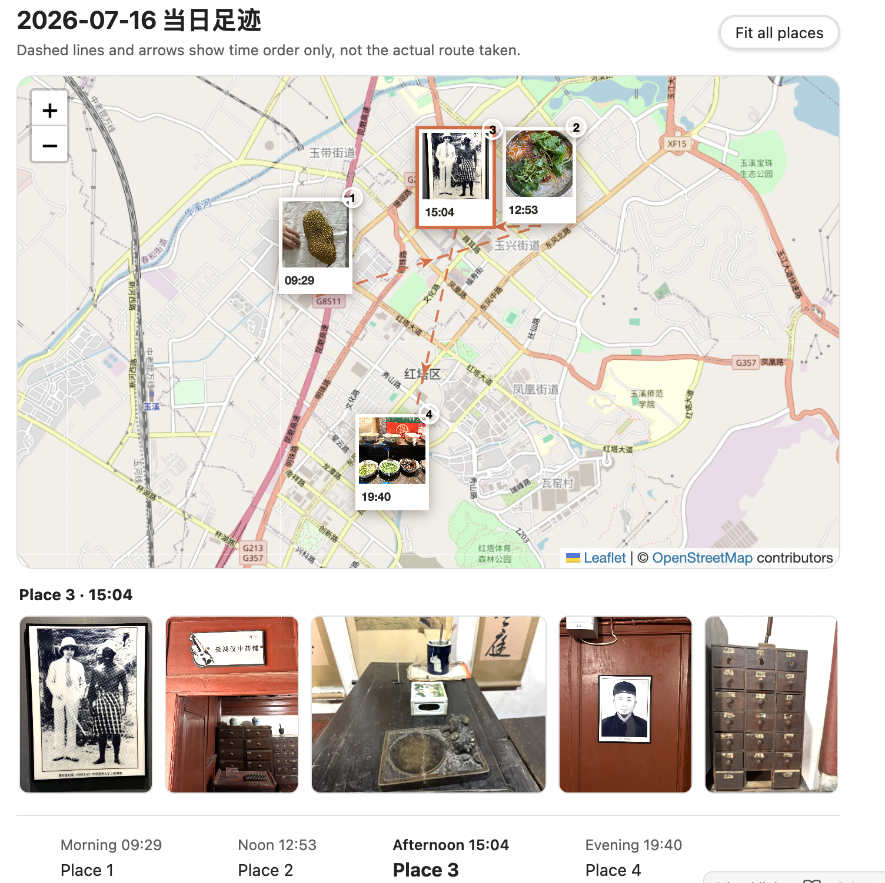

# Footprint Map

Footprint Map renders a local, time-ordered travel diary from photo locations inside Obsidian. It keeps the footprint data in portable GeoJSON, links each place to local photos, and draws dashed straight arrows to show visit order—not the route actually travelled.

中文说明见 [简体中文](#简体中文)。



*Visualize a day's photo journey on an interactive map, with time-ordered places, photo galleries, and a synchronized timeline.*

## Features

- Generate visits from embedded JPEG, HEIC, and PNG photo metadata.
- Group consecutive photos within 200 metres of the first photo into one place.
- Render with OpenStreetMap, an AMap static basemap, custom raster tiles, or no basemap.
- Keep photo markers, the timeline, and order lines available when a basemap fails.
- Browse every photo associated with the selected place.
- Export a local SVG fallback for readers that cannot run the plugin.
- Store footprint data in GeoJSON next to the note instead of a proprietary database.
- English and Simplified Chinese interface.

## Requirements

- Obsidian 1.11.5 or later.
- Photos need GPS metadata and a timestamp with an explicit UTC offset to be imported automatically.
- Network access is needed only for an online basemap. Footprint data and photos remain usable without one.

## Installation

### Community plugins

After the plugin is accepted into the Obsidian community directory:

1. Open **Settings → Community plugins**.
2. Search for **Footprint Map**.
3. Select **Install**, then **Enable**.

### Manual installation

1. Download `main.js`, `manifest.json`, and `styles.css` from the same GitHub release.
2. Create `<your-vault>/.obsidian/plugins/footprint-map/`.
3. Put the three files in that directory.
4. Reload Obsidian and enable **Footprint Map** under **Community plugins**.

Do not copy another person's `data.json`; it contains vault-specific preferences and secret references.

## Quick start

1. Open a Markdown note that embeds local JPEG, HEIC, or PNG photos.
2. Run **Generate footprint from photos in the current note** from the command palette.
3. Review the generated `.footprint.geojson` file and the `footprint-map` code block appended to the note.
4. Run **Export a static footprint preview** if you also want an SVG fallback.

Only valid photo metadata is imported. Missing GPS, missing timezone information, and damaged files are reported rather than guessed.

## Markdown format

````markdown
```footprint-map
source: 2026-07-17.footprint.geojson
height: 520
fallback: 2026-07-17.footprint.svg
title: Daily footprint
tiles: true
tileProvider: osm
```
````

`source` and `fallback` are resolved relative to the current note. `tileProvider` supports `osm`, `amap`, and `custom`. If it is omitted, the plugin setting is used. Set `tiles: false` to prevent all online basemap requests while retaining markers, the timeline, and connecting lines.

## Basemaps

### OpenStreetMap

OpenStreetMap is the default and works without an API key. The plugin displays the required attribution and requests only tiles for the viewport being viewed. It does not implement bulk download, prefetch, or offline tile packages. The public OpenStreetMap tile service is best-effort and may be unavailable or restrict traffic under its usage policy.

### AMap

AMap is optional and intended mainly for users in mainland China.

1. Create an AMap **Web Service** API key. A Web (JS API) key is a different credential type and will not work here.
2. In **Settings → Footprint Map**, select or create an Obsidian secret containing that Web Service key.
3. Select **AMap static map** as the default basemap.

The plugin stores only a SecretStorage identifier in `data.json`. It never writes the AMap credential value to Markdown, GeoJSON, SVG, or release files. The old JavaScript API key and security code settings are removed during migration and are not silently reused as a Web Service key.

AMap is requested as a static image after the initial view settles and after a drag or zoom ends. The request is debounced; Footprint Map does not prefetch or bulk-cache AMap images. Photo cards, selection, the timeline, dashed order lines, and arrows are rendered locally by Leaflet and remain interactive. Users are responsible for their own AMap account, key restrictions, quotas, and provider terms.

### Custom tiles

Advanced users may provide an HTTP(S) raster tile URL containing `{z}`, `{x}`, and `{y}`, the provider's required attribution, and a maximum zoom from 1 to 24. Only use a service whose licence and usage policy permit your intended use.

## Privacy and network disclosure

Footprint Map has no account, analytics, advertising, or telemetry.

When generating a footprint, the plugin locally reads only the images explicitly embedded in the active note. It extracts GPS and capture time metadata in the Obsidian client. Photo files and EXIF metadata are not uploaded by Footprint Map.

When you explicitly run a generation or export command, the plugin may create or update:

- `<note-name>.footprint.geojson` next to the note;
- `<note-name>.footprint.svg` next to the GeoJSON;
- one `footprint-map` code block in the active note.

Online basemaps necessarily contact third parties:

- OpenStreetMap receives normal tile requests, including the requesting IP address and tile coordinates for the visible map area.
- AMap receives static-map requests containing the user-provided Web Service key, visible map centre, zoom level, requested image size, and the requesting IP address.
- A custom tile provider receives requests for the tiles visible in the current viewport.

Set `tiles: false` to use no-basemap mode and avoid these basemap requests. Refer to each provider's privacy policy and terms for its own processing practices.

## Data ownership and backups

GeoJSON, SVG, Markdown, and photo references remain ordinary files in your vault. Back them up as you would any other notes. Disabling or uninstalling the plugin does not delete generated files. Before running generation on important notes, keep a current backup or use version control.

## Troubleshooting

- **No visits generated:** verify that the embedded photos contain GPS and an explicit timezone offset.
- **Basemap missing:** markers and the timeline should remain available. Check connectivity and the selected provider's configuration.
- **AMap fails:** confirm that the selected secret contains a Web Service API key, the key is enabled for the static map service, and the account still has available quota. The plugin keeps markers, lines, photos, and the timeline available without a basemap.
- **HEIC preview unavailable:** the visit remains valid even if the host cannot decode the image. Converting the displayed copy to PNG or JPEG may help.
- **Wrong language:** choose Auto, English, or Simplified Chinese under **Settings → Footprint Map**, then reload the plugin.

## Development

```sh
npm ci
npm run check
npm run package
```

Production plugin assets are written to `release/footprint-map/`. The project also builds a standalone browser viewer and a Node.js CLI; those tools are not installed by the Obsidian community plugin package.

CLI example:

```sh
node dist/cli/footprint-map.mjs generate \
  --input /path/to/vault/trips/example/logs/2026-07-17.md \
  --vault /path/to/vault \
  --height 520 \
  --tile-provider osm \
  --timezone Asia/Shanghai
```

The CLI previews changes unless `--apply` is explicitly provided.

See [CONTRIBUTING.md](CONTRIBUTING.md), [SECURITY.md](SECURITY.md), and [THIRD_PARTY_NOTICES.md](THIRD_PARTY_NOTICES.md).

## Licence

Footprint Map is released under the [MIT License](LICENSE). Third-party components retain their own licences as listed in [THIRD_PARTY_NOTICES.md](THIRD_PARTY_NOTICES.md).

## 简体中文

Footprint Map 从 Obsidian 笔记引用的本地照片中读取 GPS 与带时区的拍摄时间，生成按时间排序的互动足迹。地点之间的虚线和箭头只表示先后顺序，不表示实际街道路程。

### 快速使用

1. 安装并启用插件。
2. 打开引用了本地 JPEG、HEIC 或 PNG 照片的笔记。
3. 在命令面板执行“从当前笔记的照片生成足迹”。
4. 插件会在笔记旁生成 GeoJSON，并在笔记中加入 `footprint-map` 代码块。
5. 如需静态降级图，再执行“导出当前笔记的静态足迹图”。

默认底图为 OpenStreetMap，无需 Key。中国大陆用户可以切换高德静态地图，并在 Obsidian 安全存储中选择或创建包含“Web 服务 API Key”的凭据；旧的 Web 端（JS API）Key 不能代替该 Key。高德请求只在视野稳定或拖动、缩放结束后防抖发起；点位、连线、照片和时间轴仍在本地渲染。高级用户也可以使用自定义瓦片，或设置 `tiles: false` 完全关闭在线底图。

插件不包含遥测、广告或账户系统。照片与 EXIF 在本地读取；启用在线底图时，当前视野对应的瓦片请求会发送给所选地图服务商。禁用或卸载插件不会自动删除已生成的 GeoJSON、SVG 或 Markdown 内容。

项目使用 [MIT License](LICENSE) 开源；第三方组件许可声明见 [THIRD_PARTY_NOTICES.md](THIRD_PARTY_NOTICES.md)。
