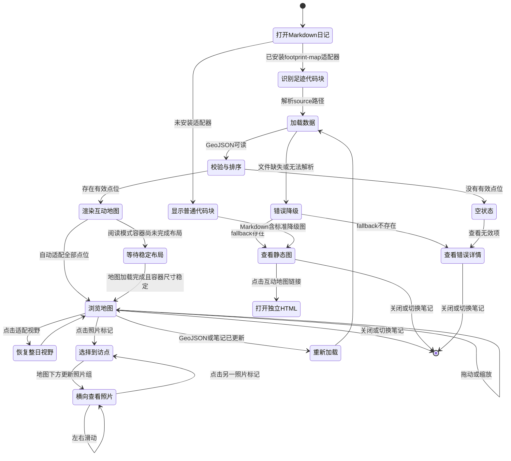

# 交互图：Footprint Map

**职责：** 描述用户在 Markdown 日记中加载、查看和操作单日足迹地图时的页面状态、转换与异常降级。

## 交互图

## 主任务路径

1. 用户打开包含 `footprint-map` 代码块的日记。
2. 插件读取代码块中的 `source`，加载 GeoJSON 并从早到晚排序点位。
3. 地图首次显示时自动适配所有有效点位，同时渲染第一张照片缩略图、圆心位于卡片右上角的序号徽标、底部时间、直线虚线和箭头。
4. 用户拖动或缩放地图，也可一键恢复整日视野。
5. 用户点击照片点位，地图下方的独立浏览区切换为该地点全部照片，并可横向滑动。
6. 笔记或 GeoJSON 更新后，当前地图应在不重启 Obsidian 的情况下重新渲染。

## 地图内交互

- **拖动：** 改变当前视野，不改变足迹数据。
- **缩放：** 通过地图 `+`/`−` 控件、移动端双指手势、Mac 触控板捏合，或按住 `Command`/`Ctrl` 后滚动调整比例；无修饰键双指滚动或鼠标滚轮继续滚动 Markdown 页面，不改变地图级别。
- **适配视野：** 将所有有效点位恢复到当前地图容器内。
- **到访点：** 以首图作为 1.5 cm 方形缩略图，序号徽标圆心位于卡片右上角并主要处于图片外侧，底栏只显示第一张照片时间；点击切换选中态。
- **照片：** 不在地图上打开弹层；地图下方独立区域横向排列所选地点的全部照片，单图高度不超过 4 cm，可左右滑动。
- **顺序轨道：** 地图下方显示同样的 1→2→3 时间摘要，即使地图被拖动也可理解当日顺序。

## 异常与降级

- `source` 缺失：在原地显示字段级错误，不请求默认网络地址。
- GeoJSON 整体无效：显示错误摘要与降级图。
- 部分点位无效：显示其他点位，并列出被忽略数量及原因。
- 照片丢失：显示点位、时间和照片占位，不删除到访记录。
- 底图丢失：尝试显示点线层；若渲染容器整体失败，显示静态图。
- 未安装适配器：保留普通代码块，使用标准 Markdown 图片和链接降级。

## 本轮不展示的交互

- 地图内直接编辑点位、拖动点位或修改照片引用。
- GPX 导入、停留点自动识别与照片时间匹配。
- 跨日、旅程或年度足迹汇总。
- 分享、公开发布、协作编辑与社交功能。
