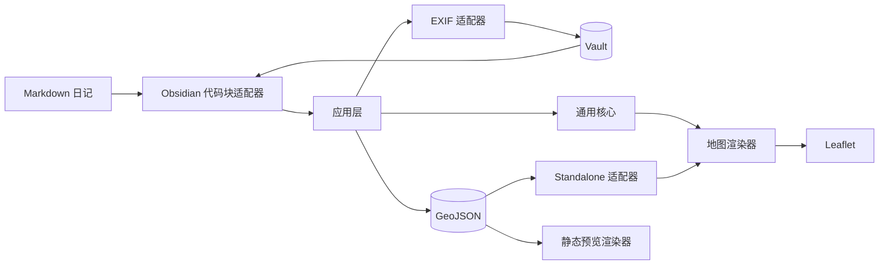
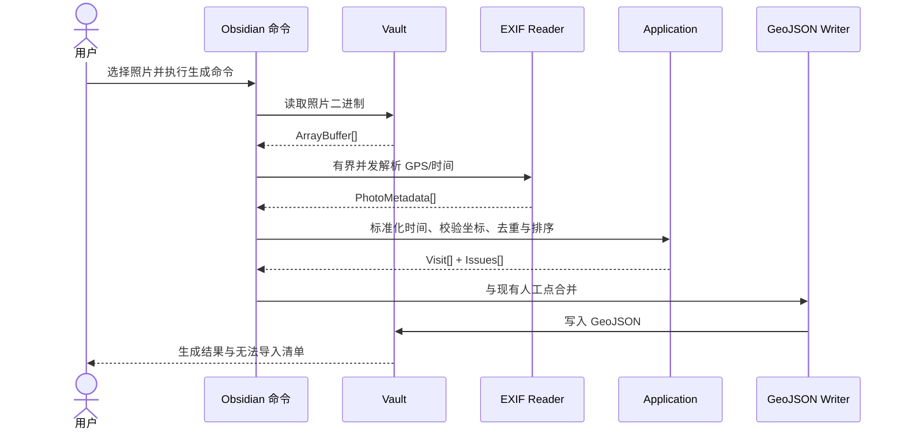

# TRD：Footprint Map

**职责：** 将 REQ-004 v0.13 转化为可实施的技术基线，定义技术选型、代码层级、核心接口、数据格式、渲染流程、错误模型、测试范围与发布产物。

## 文档状态

- 状态：技术设计草案，待实施前审阅。
- TRD 版本：v0.1。
- 需求基线：[[../../Requirements/REQ-004-可移植Markdown互动足迹地图|REQ-004 v0.13]]。
- 项目设计：[[design|设计图]]、[[interaction|交互图]]、[[visual|效果图]]。
- 实施状态：MVP 源码、自动化测试、Obsidian 包与 standalone 产物已创建；待真实宿主和照片样本验收。

## 技术目标

1. 在 Obsidian Desktop 和可行的 Mobile 运行时中，将 `footprint-map` fenced code block 渲染为互动地图。
2. 从 Vault 内 JPEG/HEIC/PNG 二进制数据提取 GPS 与拍摄时间，按 200 米首张锚点规则聚合并生成版本化 GeoJSON。
3. 按精确时间将到访点排序，用虚线与箭头表示顺序，不请求道路导航数据。
4. 使 Obsidian 和独立 HTML 查看器共用业务逻辑与地图渲染器。
5. 未安装适配器或地图失败时，保留可读源数据、错误说明与静态降级图。
6. 项目在独立副本中构建、测试和运行，不依赖工作区内其他项目。

## 非技术目标

- 不实现操作系统后台定位或定时任务。
- 不调用 PhotoKit、Core Location、MapKit、ImageIO 或原生桥接。
- 不启动 Python、Swift、原生可执行文件或守护进程。
- 不遍历系统照片库；只处理 Vault 内或用户主动导入的文件。
- 不还原实际行走街道，不生成导航路线。
- 不在 MVP 中提供地图内拖动编辑到访点。

## 架构决策

### ADR-001：单一 TypeScript 项目

- 使用一个 `package.json` 和一套 TypeScript 源码。
- 不在 MVP 创建 monorepo 或多个 npm package。
- 通用核心、渲染器、Obsidian 适配器与 standalone 适配器通过目录边界解耦。
- 第二 Markdown 适配器落地后，再根据真实重用边界判断是否拆分 packages。

### ADR-002：Leaflet 1.x 作为地图渲染库

- MVP 选用 Leaflet 1.x 稳定版，实施时通过 lockfile 锁定确切版本。
- 选择原因：体积较小，支持标记、弹层、虚线 Polyline、GeoJSON、触摸、视野适配和自定义 DOM 标记。
- 箭头使用 `leaflet-polylinedecorator` 或本项目封装的等价 Leaflet 线装饰层。
- 渲染层不向业务层暴露 Leaflet 类型，方便未来替换渲染库。
- 选型依据：[Leaflet API](https://leafletjs.com/reference)、[Leaflet GeoJSON](https://leafletjs.com/examples/geojson/)。

### ADR-002A：高德 JS API 2.0 作为中国大陆可选渲染器

- 通过 `tileProvider: amap` 显式选择，不破坏现有 `osm` 配置。
- Key 与可选 `securityJsCode` 只保存在宿主设置；源码、Markdown、GeoJSON 和 release 包不写入凭据。
- GeoJSON 继续保存 WGS84；渲染时由插件内的纯 TypeScript 算法转换为 GCJ-02，避免依赖高德在线坐标转换服务。
- 照片 Marker、地图外横向照片浏览区、虚线 Polyline、方向箭头与视野适配由高德适配器实现，领域层不依赖高德类型。
- 高德脚本与底图属于显式联网能力，失败时进入现有错误/静态图降级路径；坐标转换可离线完成。
- 高德首次视野适配等待地图 `complete` 与容器非零稳定尺寸，并以 `ResizeObserver` 处理 Obsidian 阅读模式的延迟布局；首次成功后停止自动适配，避免覆盖用户操作。
- 作为 Markdown 内嵌组件，高德设置 `scrollWheel: false`、Leaflet 设置 `scrollWheelZoom: false`，让桌面滚动事件继续服务于文档浏览，同时保留主动地图交互。

### ADR-003：`exifr` 作为 EXIF 解析实现

- 通过项目内 `PhotoMetadataReader` 接口封装 `exifr`，业务层不直接依赖第三方输出形状。
- 优先使用适用于浏览器的 ESM lite/custom bundle，只包含 JPEG、HEIC、TIFF/EXIF 和 GPS 所需能力。
- 输入为 `ArrayBuffer | Uint8Array`，输出统一转换为项目内部 `PhotoMetadata`。
- HEIC 只承诺解析 EXIF/GPS；`exifr` 不作为 HEIC 像素解码器或缩略图来源。
- 选型依据：[`exifr` 官方仓库](https://github.com/MikeKovarik/exifr)。

### ADR-004：原生 DOM，不引入 UI 框架

- 不引入 React、Vue、Svelte 或状态管理库。
- Leaflet 负责地图 DOM，项目使用原生 DOM API 创建标记、时间轨道、错误和降级内容。
- 所有用户文本使用 `textContent` 或等价安全 API，不将 GeoJSON 字符串直接赋给 `innerHTML`。
- 地图点位以照片组第一张图作为 1.5 cm 方形缩略图；18 px 序号徽标圆心与拍立得卡片右上角重合，使用 10% 白色背景、黑色数字和中等字重减少遮挡，加宽底栏左对齐显示时间。
- 地图外照片浏览区承接点位选择状态，横向滚动展示该点全部照片，单张图片高度不超过 4 cm；地图上不再打开照片弹窗。

### ADR-005：GeoJSON 为事实来源

- 互动地图、独立 HTML 和静态预览都从同一份 GeoJSON 加载。
- Markdown 代码块只保存轻量渲染配置与 `source` 路径，不内联大量足迹数据。
- 连线由点位时间派生。可导出 `LineString`，但不将它作为排序事实来源。

### ADR-006：HEIC 预览采取能力检测与降级

- GPS 解析和照片像素显示是两条独立链路。
- 首先尝试宿主资源 URL 是否可被 `` 解码。
- 无法解码时，MVP 显示包含序号、时间与文件名的照片占位。
- JavaScript/WASM HEIC 转码只作为实施阶段独立 spike；未验证体积、内存与移动端稳定性前不进入 MVP 主路径。

### ADR-007：静态降级不依赖底图截图

- 从同一份 GeoJSON 生成一张 SVG 地理关系预览：使用经纬度边界将点位投影到中性画布，绘制序号、时间、标题、虚线和箭头。
- 根据宿主能力可将 SVG 转为 PNG；如果转换不稳定，保留 SVG 与文本时间列表作为 MVP 降级。
- 不对第三方地图瓦片做 DOM 截图，避免 CORS、归属与离线失败导致降级产物不可重现。

## 系统上下文



## 代码层级与依赖方向

```text
adapters/obsidian ─┐
                   ├──> application/ ──> core/
adapters/standalone┘          │
                                 ├──> metadata/
                                 ├──> renderer/
                                 └──> platform/
tools/cli --------------------┘

renderer/ ------> core/ 的视图模型
metadata/ ------> core/ 的元数据类型
platform/ ------> 宿主文件与资源 URL 能力
core/ ----------> 无 Obsidian、Leaflet 或 DOM 依赖
```

约束：

- `core/` 不得导入 `obsidian`、`leaflet`、DOM API 或 Node.js API。
- `renderer/` 不得读取 Vault，只接收已解析的视图模型与资源 URL 回调。
- `metadata/` 不得写入 GeoJSON 或操作 DOM，只转换照片二进制数据。
- `adapters/` 可依赖应用层，但业务层不得反向依赖适配器。
- `platform/` 是可替换端口，Obsidian 和 standalone 分别提供实现。
- `tools/` 允许依赖 Node.js 文件 API，但必须复用 application/core/metadata 逻辑，不复制照片聚合、校验或序列化规则。

## 预期代码目录

```text
projects/footprint-map/
├── package.json
├── package-lock.json
├── tsconfig.json
├── esbuild.config.mjs
├── manifest.json
├── versions.json
├── styles.css
├── src/
│   ├── main.ts                         # Obsidian 插件入口
│   ├── core/
│   │   ├── domain.ts                   # 领域类型与不变量
│   │   ├── errors.ts                   # 结构化错误与警告
│   │   ├── geojson-schema.ts           # GeoJSON 扩展类型
│   │   ├── validate-footprint.ts       # Schema 与业务校验
│   │   ├── sort-visits.ts              # 稳定时间排序
│   │   ├── derive-period.ts            # 上午/中午/下午派生
│   │   ├── derive-segments.ts          # 相邻点与箭头段
│   │   ├── build-view-model.ts         # 生成渲染视图模型
│   │   └── stable-id.ts                # 可复现 ID 和去重键
│   ├── application/
│   │   ├── load-footprint.ts           # 加载、校验与聚合错误
│   │   ├── generate-from-photos.ts     # 照片批量生成到访点
│   │   ├── merge-manual-visits.ts      # 保留人工补点与修正
│   │   ├── write-footprint.ts          # 安全写入 GeoJSON
│   │   ├── render-footprint.ts         # 组装地图渲染流程
│   │   └── export-static-preview.ts   # SVG/PNG 降级图
│   ├── metadata/
│   │   ├── photo-metadata-reader.ts    # 元数据端口
│   │   ├── exifr-reader.ts             # exifr 适配实现
│   │   ├── normalize-captured-at.ts    # EXIF 时间与时区策略
│   │   └── photo-capabilities.ts      # HEIC 显示能力检测
│   ├── platform/
│   │   ├── file-store.ts               # 文件读写端口
│   │   ├── resource-resolver.ts        # 附件路径 -> 可渲染 URL
│   │   ├── tile-provider.ts            # 瓦片 URL 与归属
│   │   └── object-url-registry.ts     # Object URL 生命周期
│   ├── renderer/
│   │   ├── map-controller.ts           # 地图挂载、更新与销毁
│   │   ├── create-map.ts               # Leaflet Map 初始化
│   │   ├── render-visit-markers.ts     # 照片/序号标记
│   │   ├── render-sequence.ts          # 虚线与箭头
│   │   ├── render-visit-popup.ts       # 点位详情与照片列表
│   │   ├── render-timeline.ts          # 1→2→3 文本时间轨道
│   │   ├── render-map-controls.ts      # 缩放/适配视野/全屏
│   │   ├── render-fallback.ts          # 错误、空状态和静态图
│   │   ├── static-svg-renderer.ts      # 无瓦片静态 SVG
│   │   └── dom.ts                      # 安全 DOM 辅助函数
│   ├── adapters/
│   │   ├── obsidian/
│   │   │   ├── plugin.ts                 # 插件注册与命令
│   │   │   ├── code-block-config.ts      # YAML 代码块解析
│   │   │   ├── footprint-render-child.ts # MarkdownRenderChild 生命周期
│   │   │   ├── obsidian-file-store.ts    # Vault API 实现
│   │   │   ├── obsidian-resources.ts     # getResourcePath 实现
│   │   │   ├── commands.ts               # 从照片生成足迹
│   │   │   └── settings.ts               # 瓦片/时区/输出目录
│   │   └── standalone/
│   │       ├── bootstrap.ts              # 浏览器入口
│   │       ├── browser-file-store.ts     # fetch/File 读取实现
│   │       └── browser-resources.ts      # URL 解析实现
│   ├── tools/
│   │   ├── footprint-map-cli.ts          # 正式 CLI：预览、应用与结构化输出
│   │   ├── footprint-cli-core.ts         # 参数、路径与代码块纯逻辑
│   │   └── build-test-vault.ts           # 隔离的临时 Vault 回归工具
│   └── types/
│       └── leaflet-polylinedecorator.d.ts # 必要的最小类型补充
├── schema/
│   └── footprint-map-v1.schema.json
├── standalone/
│   ├── index.html
│   └── standalone.css
├── examples/
│   ├── daily-note.md
│   ├── 2026-07-17.geojson
│   └── photos/                      # 无隐私的测试图片
├── tests/
│   ├── unit/
│   │   ├── validate-footprint.test.ts
│   │   ├── sort-visits.test.ts
│   │   ├── derive-segments.test.ts
│   │   ├── normalize-captured-at.test.ts
│   │   └── static-svg-renderer.test.ts
│   ├── integration/
│   │   ├── exifr-reader.test.ts
│   │   ├── load-footprint.test.ts
│   │   └── obsidian-adapter.test.ts
│   ├── browser/
│   │   └── standalone.spec.ts
│   └── fixtures/
│       ├── jpeg-gps-ne.jpg
│       ├── jpeg-gps-sw.jpg
│       ├── heic-gps.heic
│       ├── no-gps.jpg
│       └── corrupt-image.jpg
├── scripts/
│   ├── build-plugin.mjs
│   ├── build-standalone.mjs
│   └── package-release.mjs
├── assets/
├── index.md
├── design.md
├── interaction.md
├── visual.md
└── trd.md
```

### 正式 CLI 写入约束

- 入口为 `dist/cli/footprint-map.mjs generate`，运行时要求 Node.js 20 或更高版本。
- 默认模式只读取和输出结构化预览 JSON；`--apply` 是写入真实 Markdown、GeoJSON 和 SVG 的必要显式开关。
- 输入 Markdown 必须位于指定 Vault 内；远程图片、越过 Vault 的路径和无法解析的已有 GeoJSON 均拒绝写入。
- 写入采用同目录临时文件加原子重命名；同一日志只保留一个规范 `footprint-map` 代码块。
- 重复执行时保留 `manual` 等非照片点位，并用当前照片结果替换旧 `photo-exif` 点位，继续应用 200 米首图锚点规则。
- stdout 只输出可供代理读取的 JSON 摘要，包含模式、目标文件、照片计数、点位计数、问题列表和 Markdown 是否变化。

## 核心类型

```ts
export interface FootprintDocument {
  schemaVersion: "1.0";
  title?: string;
  timezone: string;
  createdAt: string;
  visits: Visit[];
}

export interface Visit {
  id: string;
  coordinates: {
    latitude: number;
    longitude: number;
  };
  observedAt: string;
  timeConfidence: "exact-offset" | "configured-timezone" | "manual";
  label?: string;
  note?: string;
  period?: "morning" | "noon" | "afternoon" | "evening" | "night";
  source: "photo-exif" | "manual" | "gpx-stop";
  photos: VisitPhoto[];
}

export interface VisitPhoto {
  path: string;
  capturedAt?: string;
  caption?: string;
  isPrimary?: boolean;
}

export interface SequenceSegment {
  fromVisitId: string;
  toVisitId: string;
  from: Visit["coordinates"];
  to: Visit["coordinates"];
}
```

说明：上述是业务内部模型。持久化数据使用 GeoJSON，通过单一 mapper 与内部模型转换，不在各模块重复处理 `[经度, 纬度]` 与 `{ latitude, longitude }` 的顺序差异。

## GeoJSON v1 协议

### FeatureCollection 外来字段

```json
{
  "type": "FeatureCollection",
  "footprintMap": {
    "schemaVersion": "1.0",
    "title": "2026-07-17 当日足迹",
    "timezone": "Asia/Shanghai",
    "createdAt": "2026-07-17T20:00:00+08:00"
  },
  "features": []
}
```

### Visit Point

```json
{
  "type": "Feature",
  "id": "photo:attachments/2026-07-17/breakfast.jpg:2026-07-17T09:20:00+08:00",
  "geometry": {
    "type": "Point",
    "coordinates": [121.4737, 31.2304]
  },
  "properties": {
    "kind": "visit",
    "observedAt": "2026-07-17T09:20:00+08:00",
    "timeConfidence": "exact-offset",
    "label": "早餐店",
    "period": "morning",
    "source": "photo-exif",
    "photos": [
      {
        "path": "attachments/2026-07-17/breakfast.jpg",
        "capturedAt": "2026-07-17T09:20:00+08:00",
        "isPrimary": true
      }
    ]
  }
}
```

### 可选 Sequence LineString

```json
{
  "type": "Feature",
  "id": "sequence:derived",
  "geometry": {
    "type": "LineString",
    "coordinates": [
      [121.4737, 31.2304],
      [121.4365, 31.2152],
      [121.4998, 31.2421]
    ]
  },
  "properties": {
    "kind": "sequence",
    "derived": true,
    "meaning": "chronology-not-navigation"
  }
}
```

## Markdown 代码块协议

```yaml
source: attachments/footprints/2026-07-17.geojson
height: 420
fallback: attachments/footprints/2026-07-17.svg
title: 2026-07-17 当日足迹
```

### 配置模型

```ts
export interface FootprintMapBlockConfig {
  source: string;
  height?: number;
  fallback?: string;
  title?: string;
}
```

校验规则：

- `source` 必填，必须解析为 Vault 内文件，不允许 `..` 越过 Vault 根。
- `height` 默认 420，范围 240–960 像素。
- `fallback` 可选，必须是 Vault 内 SVG/PNG/JPEG/WebP。
- `title` 可选，不提供时使用 GeoJSON 标题或文件名。
- 未知字段在 v1 中记录警告但不阻止渲染，为协议扩展保留空间。

## 核心接口

### 照片元数据

```ts
export interface PhotoMetadata {
  latitude?: number;
  longitude?: number;
  capturedAtRaw?: string;
  offsetTimeOriginal?: string;
  orientation?: number;
}

export interface PhotoMetadataReader {
  read(input: ArrayBuffer | Uint8Array): Promise<PhotoMetadata>;
}
```

### 平台文件端口

```ts
export interface FileStore {
  readText(path: string): Promise<string>;
  readBinary(path: string): Promise<ArrayBuffer>;
  writeText(path: string, content: string): Promise<void>;
  exists(path: string): Promise<boolean>;
}

export interface ResourceResolver {
  resolve(path: string): Promise<string>;
  releaseAll(): void;
}
```

### 地图渲染

```ts
export interface FootprintMapRenderer {
  mount(container: HTMLElement, model: FootprintViewModel): Promise<void>;
  update(model: FootprintViewModel): Promise<void>;
  fitAll(): void;
  destroy(): void;
}
```

### 结构化结果

```ts
export interface Result<T> {
  value?: T;
  issues: FootprintIssue[];
}

export interface FootprintIssue {
  code: FootprintIssueCode;
  severity: "warning" | "fatal";
  message: string;
  path?: string;
  featureId?: string;
}
```

## 数据生成流程



### 生成规则

- 并发度默认为 4；移动端如出现内存压力，平台适配器可降为 2。
- 每张照片独立失败，不中断整批任务。
- 缺少 GPS 或拍摄时间的照片进入诊断清单，不伪造坐标或时间。
- 照片 ID 使用规范化 Vault 路径与观测时间生成，重复执行不重复添加。
- 已存在的 `source: manual` 点位及人工修改字段优先保留。
- 默认按日期生成 `attachments/footprints/YYYY-MM-DD.geojson`；输出目录可配置。

## 时间与时区策略

- 排序依赖完整 RFC 3339 `observedAt`。
- EXIF 包含 `OffsetTimeOriginal` 时，保留原始偏移并标记 `exact-offset`。
- EXIF 只有本地拍摄时间时，必须使用用户配置的 IANA 时区，并标记 `configured-timezone`。
- 没有可用时区时不默认为 UTC；将该照片标记为待用户确认。
- 手动输入时间标记 `manual`。
- 上午/中午/下午等只是展示层派生标签，不参与排序。

## 互动地图渲染流程

1. Obsidian 适配器解析代码块 YAML，并验证 `source`。
2. `loadFootprint()` 读取 GeoJSON，执行 Schema 校验与业务校验。
3. 应用层剔除无效点，聚合 warning/fatal issue，构建 `FootprintViewModel`。
4. 渲染器创建 Leaflet Map、瓦片层、到访点层、连线层、箭头层和控件层。
5. 主照片可显示时作为 marker；不可显示时使用序号占位。
6. 使用 `fitBounds` 适配全部有效点位，单点使用配置的默认缩放级别。
7. 地图下方渲染同序文本时间轨道。
8. Markdown 组件销毁时，移除 Leaflet Map、事件监听、Object URL 和未完成任务。

## 连线与箭头算法

- 输入为稳定排序后的 `Visit[]`。
- 对索引 `i` 生成 `visits[i] -> visits[i + 1]`。
- 坐标完全相同时不绘制零长线段，仅通过序号与时间轨道表达顺序。
- 线段样式默认为中等对比度虚线，不使用导航常见的粗实线。
- 每段在距起点约 65% 位置显示一个箭头；线段太短时隐藏箭头。
- 该比例是渲染默认值，可经视觉验收调整，不存入 GeoJSON。

## 图片加载策略

- marker 只加载每个到访点的一张主照片。
- 其余照片在用户打开弹层后懒加载。
- 通过宿主 `ResourceResolver` 生成可显示 URL，不将照片 base64 内联到 GeoJSON。
- 不为所有照片预先读取完整二进制；只有生成足迹时读取 EXIF，渲染时由宿主资源 URL 加载图像。
- 照片加载失败不删除到访点，改为序号占位并产生 warning。
- 组件卸载时释放所有项目创建的 Object URL。

## 底图与网络

```ts
export interface TileProviderConfig {
  id: string;
  urlTemplate: string;
  attribution: string;
  maxZoom: number;
}
```

- MVP 只提供一个有明确归属的默认瓦片配置，并允许用户关闭底图。
- 不在源码中固定私有 API Key。
- 网络请求只用于地图瓦片；EXIF、GeoJSON、照片和静态降级全部在本地。
- 瓦片失败时，继续显示中性背景上的点、线、箭头与文本轨道。
- 不在 MVP 中实现瓦片离线缓存。

## 错误码

| 代码 | 级别 | 处理 |
| --- | --- | --- |
| `FM_CONFIG_SOURCE_REQUIRED` | fatal | 显示代码块配置错误。 |
| `FM_SOURCE_NOT_FOUND` | fatal | 显示 `source` 路径和 fallback。 |
| `FM_GEOJSON_PARSE_FAILED` | fatal | 不渲染错误数据，显示 fallback。 |
| `FM_SCHEMA_UNSUPPORTED` | fatal | 提示升级插件或迁移数据。 |
| `FM_VISIT_INVALID_COORDINATES` | warning | 忽略当前点并显示诊断数量。 |
| `FM_VISIT_INVALID_TIME` | warning | 忽略当前点，不猜测顺序。 |
| `FM_NO_VALID_VISITS` | fatal | 显示空状态与诊断列表。 |
| `FM_PHOTO_NOT_FOUND` | warning | 保留到访点，显示占位。 |
| `FM_PHOTO_PREVIEW_UNAVAILABLE` | warning | HEIC/宿主无法解码，显示序号占位。 |
| `FM_EXIF_GPS_MISSING` | warning | 不生成照片点，加入导入报告。 |
| `FM_EXIF_TIME_MISSING` | warning | 不猜测时间，加入导入报告。 |
| `FM_TIMEZONE_REQUIRED` | warning | 等待用户提供时区后再生成。 |
| `FM_TILE_UNAVAILABLE` | warning | 保留中性背景上的点线层。 |

## 安全与隐私

- 使用 Obsidian `normalizePath()` 或等价逻辑处理用户路径。
- 拒绝越过 Vault 根的相对路径。
- 标题、备注、照片说明和错误文本都作为不可信字符串。
- 不执行 GeoJSON 中的 HTML、JavaScript、事件属性或外部图片 URL。
- 照片路径默认只允许 Vault 内文件；远程照片不纳入 MVP。
- 不收集 telemetry，不上传照片、坐标、GeoJSON 或笔记。
- 在 README 和设置页说明地图瓦片请求会暴露所查看的大致地图范围。
- 所有 npm 依赖记录许可证并通过 lockfile 固定。

## 性能策略

- 首次渲染只解析 GeoJSON 和主照片 URL，不重新读取 EXIF。
- EXIF 解析只在用户显式执行“从照片生成足迹”命令时发生。
- 一个地图实例只创建一个 Leaflet Map，数据更新时替换 layers 而不重复叠加容器。
- 高密度点位在超过 100 个时可降级为序号 marker；聚合库不默认进入 MVP。
- 大图与非主照片使用懒加载。
- 对单日 100 点、300 张照片进行基准测试；正式时间和内存门槛在目标设备确认后固定。

## 可访问性

- 地图容器使用 `title` 生成可读标签。
- 每个到访点有文本名称，并可通过键盘聚焦和 Enter/Space 打开。
- 顺序同时通过数字、箭头和文本时间轨道表达，不只使用颜色。
- 文本时间轨道是地图的等价摘要，应位于同一渲染组件内。
- 到访点照片使用地点名、时间或文件名生成 `alt`。
- 控件不依赖 hover 才可发现，支持桌面指针与触摸。

## 测试策略

### 单元测试

- GeoJSON 结构与版本校验。
- `[经度, 纬度]` 转换和坐标越界。
- RFC 3339 时间、偏移、空时区与稳定排序。
- 时段标签派生。
- 相邻线段、同坐标及单点数据。
- 人工点保留、照片点更新与重复执行去重。
- 静态 SVG 的边界投影、序号与箭头。

### 集成测试

- JPEG 东/西经、南/北纬与拍摄时间。
- HEIC GPS/EXIF 可读但缩略图不做强承诺。
- 缺失 GPS、缺失时间、损坏图片与不支持格式。
- Obsidian Vault 路径、中文、空格、`#`、`%` 和括号。
- 代码块解析、fallback 与 MarkdownRenderChild 销毁。
- 数据更新后不重复创建 Leaflet Map 或泄漏 Object URL。

### 浏览器验收

- Standalone 页面可拖动、缩放和适配全部点位。
- 三点数据正确显示 1→2→3 两段箭头。
- 点击 marker 显示时间、地点、备注和照片。
- 瓦片请求失败时仍显示点线和时间轨道。
- 窄屏时标记不遮挡地图控件，时间轨道改为纵向布局。
- 浅色和深色主题下序号、箭头和文标保持可辨认。

### 测试资产

- 测试图片必须为项目自行制作或可重分发资产。
- 所有 GPS 和 EXIF 值为专用测试数据，不使用用户真实住址或私人照片。
- 用例必须包含东经北纬、西经南纬和无 GPS 三类。

## 依赖策略

### 预期运行时依赖

| 依赖 | 用途 | 备注 |
| --- | --- | --- |
| `leaflet` | 互动地图 | 锁定 1.x 稳定版，不使用 2.x alpha。 |
| 项目内 Leaflet 箭头层 | 线段箭头 | 使用地理中点 marker，并在地图移动/缩放后按屏幕投影更新角度，不增加运行时依赖。 |
| `exifr` | JPEG/HEIC/PNG EXIF/GPS | PNG 需要 full ESM 构建；生产包仍不引入 Node `fs` 路径。 |
| 项目内 validator | GeoJSON 扩展校验 | 逐 Feature 返回结构化错误，损坏单点不阻止其他有效点；同时发布标准 JSON Schema。 |

### 预期开发依赖

- `typescript`：类型检查与编译。
- `esbuild`：Obsidian 与 standalone 双入口打包。
- `vitest`：单元与集成测试。
- `playwright`：独立 HTML 的最小真浏览器验收；若依赖下载成本过高，可在开发阶段后置到视觉验收切片。
- `@types/leaflet`、`@types/geojson`：类型声明。

原则：

- 实施前核对每个直接依赖的许可证、当前维护状态、包体积与浏览器构建行为。
- 不引入包含 telemetry 的依赖。
- 生产构建不从 CDN 动态加载 JavaScript 依赖。
- 依赖版本由 lockfile 锁定，不在 TRD 中使用浮动的 `latest`。

## 构建与脚本

```json
{
  "scripts": {
    "dev": "node esbuild.config.mjs --watch",
    "build": "node esbuild.config.mjs",
    "build:plugin": "node scripts/build-plugin.mjs",
    "build:standalone": "node scripts/build-standalone.mjs",
    "typecheck": "tsc --noEmit",
    "test": "vitest run",
    "test:watch": "vitest",
    "test:browser": "playwright test",
    "check": "npm run typecheck && npm run test && npm run build",
    "package": "node scripts/package-release.mjs"
  }
}
```

说明：上述为预期接口，不表示 `package.json` 已存在。实施时不使用 shell 平台特有命令串联构建步骤。

## 打包产物

### Obsidian 插件

```text
release/footprint-map/
├── main.js
├── manifest.json
└── styles.css
```

- `main.js` 包含本地打包的运行时依赖，`obsidian` 作为 external。
- `manifest.json` 的 `isDesktopOnly` 预设为 `false`；任何 Node/Electron 依赖都会破坏该目标。
- 样式只作用于 `.footprint-map-*` 命名空间，不覆盖宿主全局标签。

### Standalone

```text
dist/standalone/
├── index.html
├── footprint-map.js
└── footprint-map.css
```

- 通过页面参数、同目录配置或用户文件选择器加载 GeoJSON。
- 开发期可由静态服务加载；是否产出完全单文件 HTML 在实施 spike 后决定。
- Standalone 不认识 Obsidian Wiki 链接，照片路径按 GeoJSON URL 的相对路径解析。

## Obsidian 集成细节

- 通过 `registerMarkdownCodeBlockProcessor("footprint-map", ...)` 注册阅读模式处理器。
- 代码块 YAML 优先使用 Obsidian 已提供的 YAML 解析能力，不因该适配器额外引入通用 YAML 运行时。
- 每个地图实例由一个 `MarkdownRenderChild` 管理，在 `onunload()` 中销毁地图和资源。
- GeoJSON 使用 Vault 文本读取 API，照片 EXIF 使用 Vault 二进制读取 API。
- 附件显示使用宿主资源 URL 能力，不在移动端将 Vault adapter 强制转型为 `FileSystemAdapter`。
- 生成命令优先作用于当前选中的 Vault 照片、当前文件链接的照片，或用户选定的 Vault 目录。
- 不通过系统 PhotoKit 或绝对文件路径扫描照片。

## 可移植性接口

为下一个 Markdown 解析器预留且只预留以下端口：

```ts
export interface FootprintHostAdapter {
  fileStore: FileStore;
  resources: ResourceResolver;
  tileProvider: TileProviderConfig | null;
  parseBlock(source: string): Result<FootprintMapBlockConfig>;
}
```

新适配器需实现：

1. 代码块注册。
2. 平台附件路径与 URL 转换。
3. 组件挂载/销毁。
4. 平台主题变化通知，若平台支持。

新适配器不重新实现：

- GeoJSON 校验。
- 时间排序。
- 到访点和线段生成。
- Leaflet 标记、箭头和时间轨道。
- 照片弹层和错误状态。

## 实施切片

### Slice 1：通用核心与示例数据

- 创建 TypeScript 项目、构建、测试与 GeoJSON Schema。
- 实现校验、排序、时段、线段与视图模型。
- 使用手写示例 GeoJSON 通过全部单元测试。

### Slice 2：Standalone 地图

- 实现 Leaflet 地图、标记、虚线、箭头、弹层和时间轨道。
- 验证瓦片失败、照片失败与窄屏状态。
- 完成最小真浏览器测试。

### Slice 3：Obsidian 阅读模式适配器

- 注册代码块处理器。
- 实现 Vault 文件、资源 URL 和销毁生命周期。
- 在隔离测试 Vault 中手动验收效果图对应状态。

### Slice 4：照片 EXIF 生成命令

- 实现 `PhotoMetadataReader` 与 `exifr` 适配器。
- 使用 JPEG/HEIC 无隐私样本验证 GPS 和时间。
- 实现去重、人工点保留、输出路径和导入报告。

### Slice 5：降级图与打包

- 实现静态 SVG 关系图与可行的 PNG 转换。
- 完成 Obsidian 产物与 standalone 产物打包。
- 校验干净副本可安装、构建、测试与运行。

## 技术验收门槛

- `npm run check` 在干净副本中通过。
- `core/` 的测试不启动 Obsidian、Leaflet 或浏览器。
- 同一 GeoJSON 在 standalone 与 Obsidian 中生成相同顺序、标记文本和线段数量。
- 三个不同坐标且时间递增的点生成 3 个 marker、2 段虚线和 2 个方向箭头。
- 同坐标连续点不生成零长箭头。
- 单张损坏照片不阻止其他到访点渲染。
- 单个无效 GeoJSON feature 不会伪造或错排有效点。
- 卸载 Markdown 渲染组件后，不保留 Leaflet 事件、DOM 节点或 Object URL。
- 生产包不包含 Python、Swift、原生二进制、未记录网络请求或对其他本地项目的路径引用。

## 待实施前确认

- [ ] 首期是否必须同时交付 Obsidian Desktop 和 Mobile；本 TRD 按兼容两者设计。
- [ ] 确认默认地图瓦片提供者与可接受的联网隐私边界。
- [ ] 确认 EXIF 缺少时区时的默认 IANA 时区是否固定为 Vault/用户设置。
- [ ] 确认从照片生成足迹时，用户传入照片的首期交互是“选中文件”还是“选择 Vault 目录”。
- [ ] 确认降级图的 MVP 必须格式为 SVG，还是必须同时生成 PNG。
- [ ] 在真实 Obsidian Desktop/Mobile 中验证 HEIC `` 显示能力，再决定是否开启 JavaScript/WASM 转码 spike。

## 变更记录

### DRAFT-001：初始 TRD（v0.1）

- 类型：技术设计草案。
- 变更：固定单一 TypeScript 项目、Leaflet 1.x、`exifr`、GeoJSON、原生 DOM、Obsidian 与 standalone 双适配器的技术路线。
- 变更：定义代码目录、依赖方向、核心接口、GeoJSON v1、错误码、测试策略与五个实施切片。
- 风险：HEIC 像素显示、默认瓦片服务、无时区 EXIF 和静态 PNG 生成方式尚待验证。
