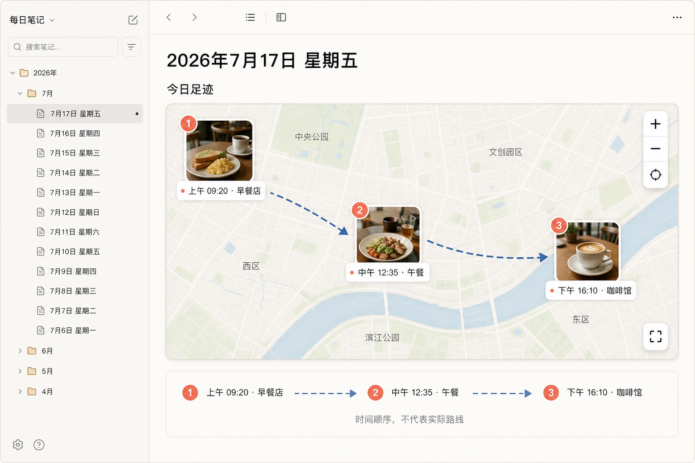

# 页面效果图：Footprint Map

**职责：** 定义 Footprint Map 在桌面端 Markdown 日记中的信息层级、视觉方向与概念效果图边界。

## 效果图

该图是用于确认布局、信息层级和互动暗示的桌面端概念稿，不是可运行插件截图，也不约束最终底图提供者、字体或图标库。

## 概念稿展示的状态

- 用户已打开 `2026年7月17日` 的 Markdown 日记。
- 足迹数据已成功加载，地图自动适配三个到访点。
- 三个到访点分别使用照片、序号、精确时间和地点名表达。
- 虚线箭头从 1 指向 2、再从 2 指向 3，不沿地图街道绘制。
- 地图右侧提供缩放、适配视野和全屏的交互暗示。
- 地图下方重复显示 1→2→3 文本时间轨道，并明示“时间顺序，不代表实际路线”。

## 信息层级

1. **日记上下文：** 文件树、日期和“今日足迹”标题将地图放在长期 Markdown 笔记中，而非独立旅行 App 中。
2. **互动地图：** 使用最大面积表达空间关系，但线路不提供导航语义。
3. **照片到访点：** 首图缩略图比普通图钉更醒目，圆心位于卡片右上角的半透明序号徽标与底部时间分层表达顺序。
4. **照片浏览区：** 与地图画布分离，位于地图下方，横向展示当前地点的全部照片。
5. **顺序连线：** 使用中等对比度虚线和少量箭头，既可见又不压过照片。
6. **文本时间轨道：** 对地图做线性补充，并作为无障碍和窄屏降级基础。

## 视觉约束

- 优先与宿主 Markdown 应用的浅色/深色主题协调，不制作脱离笔记上下文的完整 App 外壳。
- 照片标记使用约 1.5 cm 方形首图、3 px 上/左右白边和加宽底栏；18 px 圆形序号的圆心与卡片右上角重合，背景为 10% 白色、数字为黑色，底栏左对齐显示完整时间。
- 地图外照片浏览区的单张图片高度不超过 4 cm，保持原始宽高比并允许横向滚动。
- 时间轴通过字体放大和加粗表示当前地点，不改变条目背景色。
- 连线使用虚线或其他与导航路线明显不同的样式，不显示里程、预计时间或交通方式。
- 箭头在地图缩放后应保持可见，但不要在短线段上堆叠过多箭头。
- 序号、箭头和文本标签同时表达顺序，不仅依赖蓝色与珊瑚色。
- 点位重叠时允许偏移标签或使用聚合，但不改变原始坐标。
- 自动适配视野应考虑照片卡片相对坐标锚点向上延伸的高度，顶部预留大于底部的安全空间，使上下留白视觉均衡且序号徽标不贴边。
- 地图点位的方形首图使用居中裁切填满，不拉伸，也不偏向图片顶部或左侧。
- 地图高度应可在代码块中配置，并设置适合窄屏阅读的最小高度。

## 窄屏与移动端方向

- 文件树属于宿主应用，窄屏时可由宿主折叠，地图自身占满内容宽度。
- 照片标记在窄屏上继续使用缩略图、右上角圆形序号和底部时间；图片详情保留在地图外横向滚动区。
- 地图下方的时间轨道从水平布局改为纵向列表。
- 全屏地图作为可选加强，不得成为查看足迹的唯一方式。

## 未在概念稿中表达的状态

- GeoJSON 加载中、空数据、部分点位无效和整体错误。
- 照片缺失、照片轮播和大图预览。
- 深色主题、移动端、键盘导航和屏幕阅读器的最终方案。
- 无网络底图与静态预览图降级。

## 效果图产出说明

- 资产：`assets/footprint-map-concept-v1.jpg`。
- 用途：桌面端产品 UI 概念稿。
- 产出方式：使用内置图像生成工具生成，并转换为 JPEG 后进行本地视觉复检。
- 生成提示的核心约束：Markdown 桌面笔记布局、三个照片到访点、1→2→3 虚线箭头、直线时间顺序而非街道导航、无 Logo 与水印。
